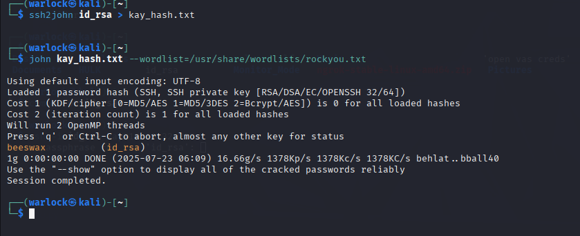

# 🛡️ TryHackMe: Basic Pentesting - VAPT Report

This is a professional-style VAPT (Vulnerability Assessment and Penetration Testing) walkthrough of the **TryHackMe - Basic Pentesting** room. It includes enumeration, exploitation, privilege escalation, and flag capture, with step-by-step methodology and supporting screenshots.

 


## 📌 Room Info

* **Platform:** [TryHackMe - Basic Pentesting](https://tryhackme.com/room/basicpentestingjt)
* **Difficulty:** Easy
* **Focus Areas:** Linux Enumeration, SMB, SSH, Hydra, John the Ripper, Privilege Escalation
* **Objective:** Get user and root flags exploitation

---


## 🧭 Methodology Summary

### 🔍 Nmap Scan

Performed an initial enumeration to discover open ports and services.

```bash
nmap -P 10.10.X.X
```
 

**Result:**

* Port 22: OpenSSH
* Port 80: Apache
* Port 139/445: SMB
* port 8009:  Apache JServ Protocol (AJP) version 13
* port 8080: http-proxy

---

### 🗂️ SMB Enumeration

Used `smbclient` to check for anonymous shares:

```bash
smbclient //10.10.X.X/Anonymous -N
```


* Found staff.txt containing username `jan`


---

### 🏗️ Web Enumeration

Used Gobuster to scan for directories:

```bash
gobuster dir -u http://10.10.X.X -w /usr/share/wordlists/dirbuster/directory-list-2.3-medium.txt -x php,html,txt
```

* No valuable data found on HTTP.


---

### 🔐 SSH Brute-Force (Hydra)

Tried brute-forcing SSH with known user `jan`:

```bash
hydra -l jan -P /usr/share/wordlists/rockyou.txt ssh://10.10.X.X
```

* **Success:** Found password for `jan`


---

### 🔓 SSH Access to User Jan

```bash
ssh jan@10.10.X.X
```

* Logged in successfully


---

### 🔍 Lateral Movement / Privilege Escalation to User Kay

Found user `kay` in `/home`


* Inspected `/home/kay/` and found `pass.bak`


  
* Couldn't `cat` it directly due to permissions
* Explored `.ssh` and found `id_rsa` private key

  


---

### 🔑 Cracked SSH Private Key (John the Ripper)

```bash
john kay.hash --wordlist=/usr/share/wordlists/rockyou.txt
```

* Found Kay's password



---

### 🔐 SSH into Kay

```bash
ssh kay@10.10.X.X
```

* Logged in and captured the **user.txt** flag


---

### 🔝 Privilege Escalation

Checked for `sudo` permissions:

```bash
sudo -l
```

* `kay` had access to `/bin/bash` as root
* Ran:

```bash
sudo /bin/bash
```

* Gained root shell
* Captured **root.txt** flag

📸 *\[Insert image showing root access]*

---

## 🏁 Flags

* **User Flag:** `THM{xxxxxxxxxxxxxxxxxxxx}`
* **Root Flag:** `THM{xxxxxxxxxxxxxxxxxxxx}`

---

## 📂 Where I Found Things

* `staff.txt` with usernames: in **SMB share: Anonymous**
* `jan`'s password: via **Hydra brute-force on SSH**
* `kay` user: found in `/home/`
* `kay`'s SSH key: in `/home/kay/.ssh/id_rsa`
* `kay`'s password: cracked using **John the Ripper** from `id_rsa`
* Root access: via **sudo /bin/bash**

---

## 📸 Images

Upload screenshots in the `/images` folder and link them above using:

```md

```

---

## ✅ Conclusion

This machine is a great introduction to Linux enumeration, brute-forcing credentials, and simple privilege escalation. All actions were performed in a controlled lab environment for educational purposes.

---

> ⚠️ **Disclaimer:** This walkthrough is intended for educational use only.
